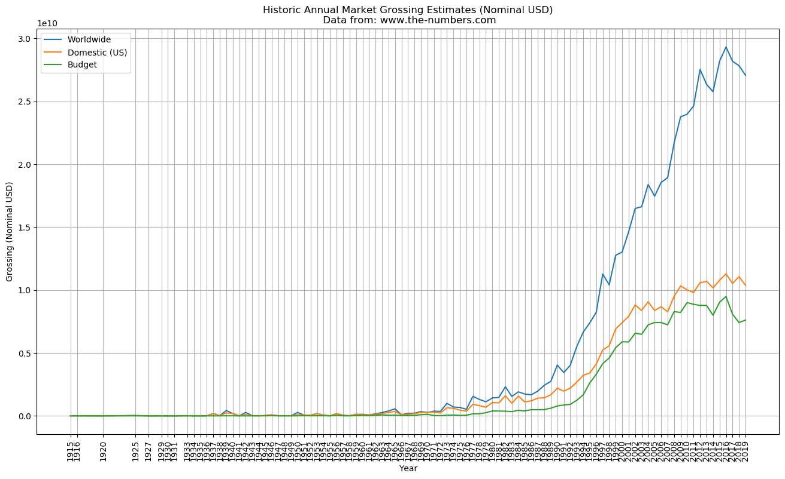
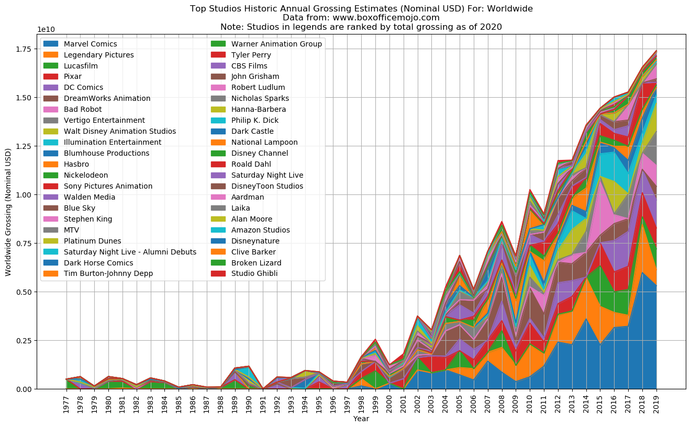
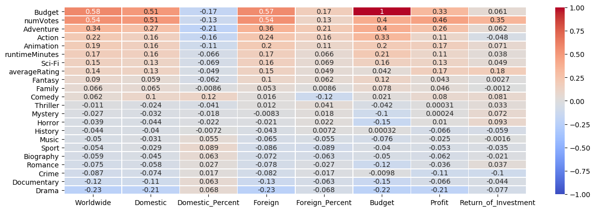
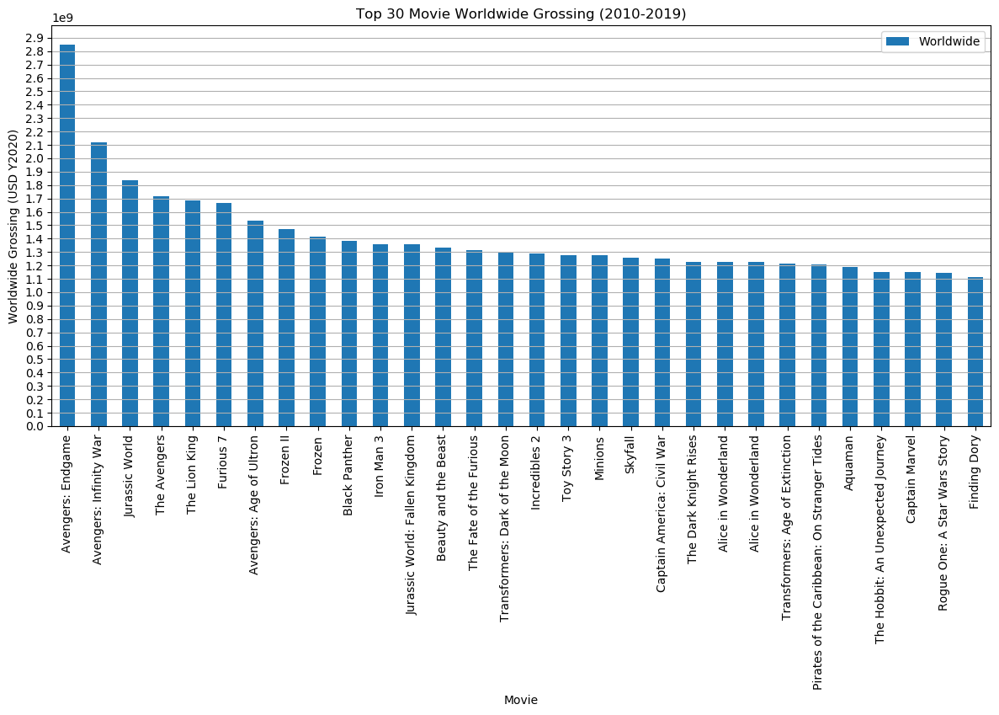
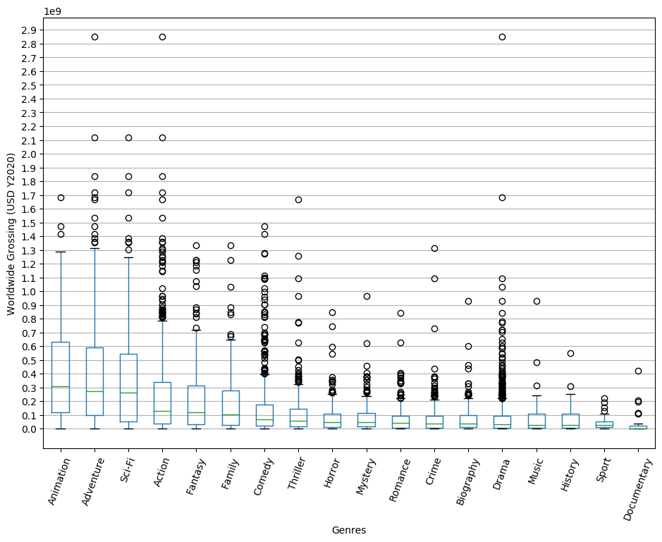
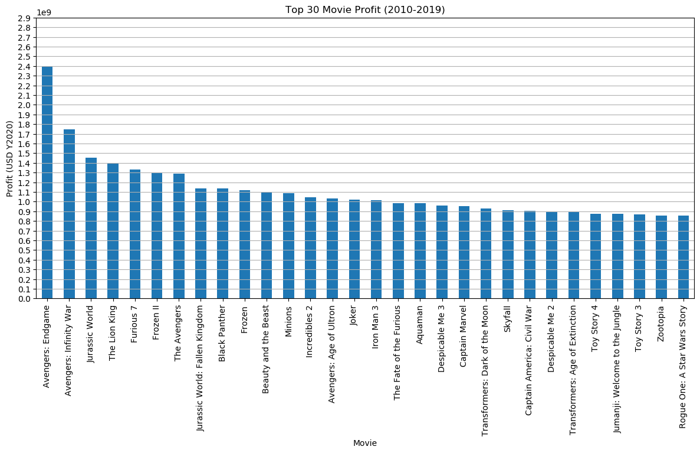
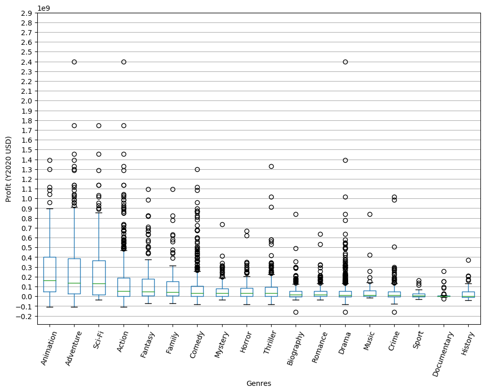
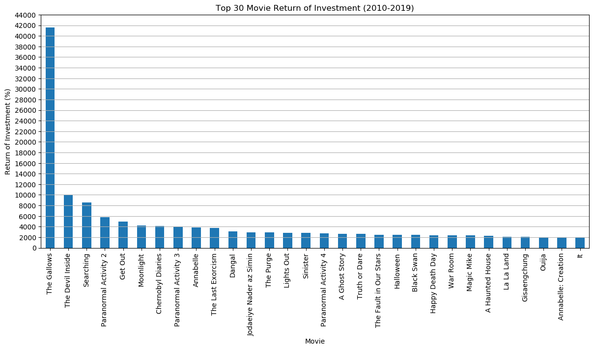
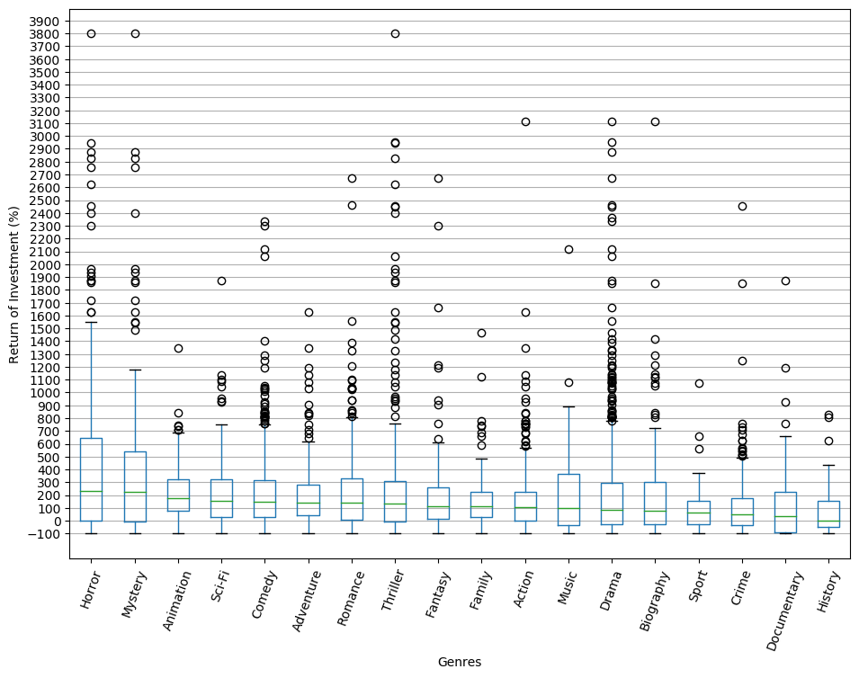

# Breaking into Movie Market 2020
## Summary
In order to assess the movie making market, data were scraped from IMDB, Box Office Mojo, and www.the-numbers.com for the most up-to-date information. This repository contains the scripts to scrape the data and as well as the Jupyter Notebook that analyzes the data.

After analyzing the data from the various resources, the following conclusions and recommendations are made:
1. The movie market is (at the start of 2020) a $25 billion dollar market with a large number of players and a constantly changing market share. Therefore, it's market penetration is possible.
2. Foreign market is currently larger than the US domestic market. Therefore, foreign market should be a big consideration when making a movie.
3. The total number of reviews of a movie has a moderate correlation with the grossing and return of investment of a movie. Therefore a survey or release of preview on social media or YouTube may be a good idea, and we can gauge public interest from the number of reviews or views.
4. Animation, Adventure, and Sci-Fi genre movies generally have strong grossing and profit compared to other genres. Therefore, we can focus on these genres if we are aiming for large revenue and market capture.
5. Horror and Mystery genre movies generally have very strong return of investment compared to other genres. Therefore, we can focus on these genres if we are aiming for high return of investment for our capitals invested.
## Repository Files Organization
- presentation.pdf: the presentation slides for non-technical presentation.
- main.ipynb: the main Jupyter Notebook containing the data exploration and analysis.
- raw_data: folder containing the scraped movie raw data.
- scrape_bom_movies.py: script to scrape from Box Office Mojo for movie basic information.
- scrape_bom_brands.py: script to scrape from Box Office Mojo for brand information.
- scrape_imdb.py: script to scrape from IMDB for movie basic information.
- scrape_tn.py: script to scrape from www.the-numbers.com for movie basic information.
## Conclusion and Recommendation
The movie market is (at the start of 2020) a $25 billion dollar market. It's a big market.

There are a large number of players and a constantly changing market share. Therefore, it's market penetration is possible.

The total number of reviews of a movie has a moderate correlation with the grossing and return of investment of a movie. Therefore a survey or release of preview on social media or YouTube may be a good idea, and we can gauge public interest from the number of reviews or views.

Animation, Adventure, and Sci-Fi genre movies generally have strong grossing compared to other genres. Therefore, we can focus on these genres if we are aiming for large revenue and market capture.

Animation, Adventure, and Sci-Fi genre movies generally have strong profit compared to other genres. Therefore, we can focus on these genres if we are aiming for large revenue and market capture.

Horror and Mystery genre movies generally have very strong return of investment compared to other genres. Therefore, we can focus on these genres if we are aiming for high return of investment for our capitals invested. Note that Horror and Mystery in itself also have a couple of extreme outlier for return of investment such that the scatter plot data only include 3 sigma of ROI so the plot would not be too out of proportion.

